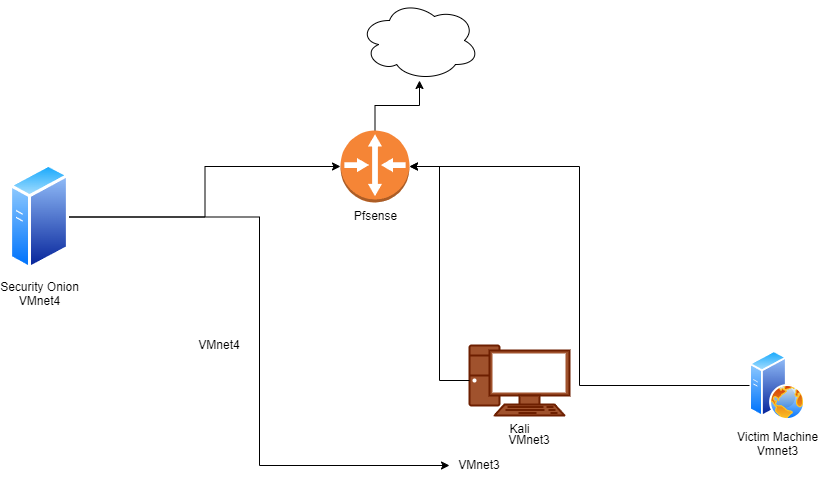

# HomeLab Setup: pfSense, Kali Linux, Security Onion, Victim Machine

## Overview

This repository contains the setup instructions and network diagram for the HomeLab environment. The HomeLab is a personal lab environment designed for learning and testing various cybersecurity concepts, including network security, penetration testing, and intrusion detection. The lab setup includes the following components:

- pfSense: A firewall and router distribution based on FreeBSD, used for network segmentation, traffic filtering, and gateway protection.
- Kali Linux: A penetration testing distribution used for conducting security assessments, penetration testing, and vulnerability analysis.
- Security Onion: A Linux distribution for intrusion detection, network security monitoring, and log management, featuring tools such as Snort, Suricata, and Zeek.
- Victim Machine: A vulnerable machine used for practicing exploitation and security testing.

## Network Diagram

The network diagram above illustrates the architecture of the HomeLab environment. It includes the following components:

- pfSense: A dedicated firewall and router protecting the internal network and providing internet access. Connected to vmnet2.
- Kali Linux: A penetration testing workstation used for conducting security assessments and exploitation testing. Connected to vmnet3.
- Security Onion: A dedicated monitoring server capturing and analyzing network traffic for intrusion detection and monitoring. Connected to vmnet4.
- Victim Machine: A separate virtual machine running vulnerable services and applications for practicing exploitation and security testing. Connected to vmnet3.

## Network Configuration

The HomeLab environment is configured with the following network settings:

- pfSense is connected to `vmnet2`.
- Kali Linux and the victim machine are connected to `vmnet3`.
- Security Onion is connected to `vmnet4`.

### Virtual Network Configuration

Ensure that your virtualization platform (e.g., VMware Workstation or VirtualBox) is configured with the following virtual networks:

- `vmnet2`: Used for connecting pfSense.
- `vmnet3`: Used for connecting Kali Linux and the victim machine.
- `vmnet4`: Used for connecting Security Onion.

## Setup Instructions

### Prerequisites

Before setting up the HomeLab environment, make sure you have the following prerequisites:

- Virtualization Software: Install a virtualization platform such as VMware Workstation or VirtualBox on your host machine.
- Virtual Machine Images: Download the necessary virtual machine images for pfSense, Kali Linux, Security Onion, and the victim machine.
- Network Configuration: Plan and configure the network topology for the HomeLab environment, including IP addressing, subnetting, and routing.

### Installation Steps

1. Import Virtual Machines: Import the downloaded virtual machine images into your virtualization software.
2. Configure Network Settings: Set up network adapters for each virtual machine and configure IP addresses, subnet masks, and gateway settings according to the network diagram and network configuration details provided above.
3. Configure pfSense: Configure pfSense as the firewall and router for the HomeLab environment, including WAN and LAN interfaces, firewall rules, and NAT settings.
4. Start Virtual Machines: Start the virtual machines in the following order: pfSense, Security Onion, Kali Linux, and the victim machine.
5. Verify Connectivity: Test connectivity between the different components in the HomeLab environment, including internet access, internal network communication, and monitoring capabilities.

## Usage

Once the HomeLab environment is set up, you can use it for various cybersecurity tasks, including:

- Network security configuration and management with pfSense.
- Penetration testing and vulnerability assessments with Kali Linux.
- Intrusion detection and network security monitoring with Security Onion.
- Exploitation testing and security assessment of vulnerable services on the victim machine.

## Contribution

Contributions to this repository are welcome! If you have suggestions for improving the HomeLab setup instructions or network diagram, please open an issue or submit a pull request.

